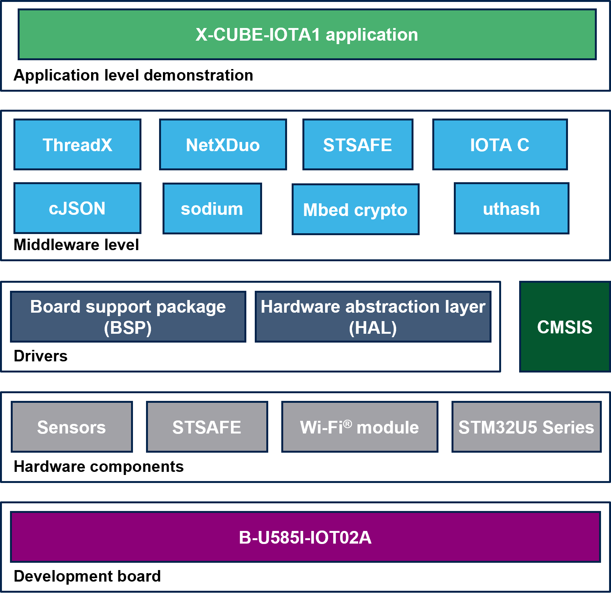

# X-CUBE-IOTA1 Firmware Package

WARNING!!!

This repository is now deprecated and not maintained any more!

WARNING!!!

The X-CUBE-IOTA1 is an expansion software package for STM32Cube.
The software runs on the STM32 and includes the middleware 
for enabling the IOTA Distributed Ledger Technology. The expansion 
is built on STM32Cube software technology to ease portability across 
different STM32 microcontrollers. The software comes with sample 
implementations on how to use the IOTA middleware on the STM32 based 
boards.

**X-CUBE-IOTA1 software features**:

- Complete firmware to build IOTA DLT applications for STM32-based boards
- Middleware libraries featuring STSAFE secure element to have a secure hardware root of trust; WiFi management; encryption, hashing, message authentication and digital signing (sodium/mbedCrypto); Azure RTOS ThreadX and NetXDuo; IOTA Client API for interacting with the Tangle
- Complete driver to build applications accessing Motion and Environmental sensors
- Examples to help understanding how to develop an IOTA DLT Client application
- Example to help understand how to build and send to the Tangle an encrypted, authenticated message stream based on L2Sec, a Layer 2 lightweight security protocol designed for embedded IoT devices
- Easy portability across different MCU families, thanks to STM32Cube
- Free, user-friendly license terms

In this FW Package, the module listed below is not directly accessible as it is subject to some restrictive license terms requiring user's approval via a "click thu" procedure. It has to be downloaded from the www.st.com website. The respective URL to download this module is available in a readme.txt file at the root of the respective folder.

- Middlewares/ST/STSAFE_Ax00

In order to build and test the IOTA DLT applications you first need to download and include the STSAFE_Axx0 module.

The figure below shows the overall architecture.

**Related information and documentation**:

- [DB3959](https://www.st.com/resource/en/data_brief/x-cube-iota1.pdf): IOTA Distributed Ledger Technology software expansion for STM32Cube
- [UM2606](https://www.st.com/resource/en/user_manual/dm00628441-getting-started-with-the-iota-distributed-ledger-technology-software-expansion-for-stm32cube-stmicroelectronics.pdf): Getting started with the X-CUBE-IOTA1 for IOTA Distributed Ledger Technology software expansion for STM32Cube
- [STM32Cube](http://www.st.com/stm32cube)
- [STM32CubeU5](https://www.st.com/content/st_com/en/products/embedded-software/mcu-mpu-embedded-software/stm32-embedded-software/stm32cube-mcu-mpu-packages/stm32cubeu5.html)
- [B-LU585I-IOT02A STM32U5 Discovery kit IoT node](https://www.st.com/en/evaluation-tools/b-u585i-iot02a.html)
- [AN5435](https://www.st.com/resource/en/application_note/an5435-stsafea110-generic-sample-profile-description-stmicroelectronics.pdf): STSAFE-A110 generic sample profile description
- [DB4064](https://www.st.com/resource/en/data_brief/x-cube-safea1.pdf): STSAFE-A110 software package
- [UM2646](https://www.st.com/resource/en/user_manual/um2646-getting-started-with-the-xcubesafea1-software-package-stmicroelectronics.pdf): Getting started with the X-CUBE-SAFEA1 software package
